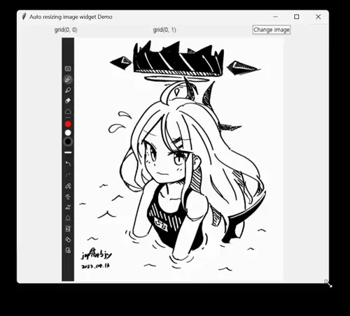

## Auto-resizing Tk image widget w/ PIL

I couldn't find a SINGLE working practical example where there's multiple widgets in grid layout.
So I made one myself.

Base64 encoding of images would make script way too large, I just made images to download from imgur.
So initial startup might take few seconds.

