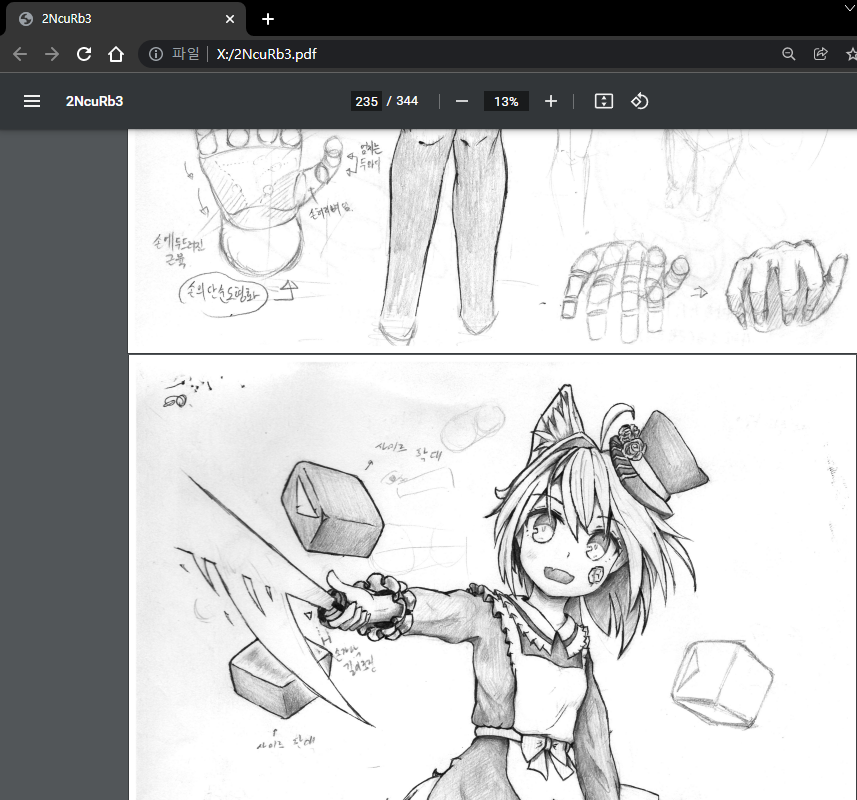

## Imgur Album to PDF downloader

Requires client_id which you can get with just few seconds from [here](https://api.imgur.com/oauth2/addclient).

## Usage:
```text
> py .\ImgurAblumToPDF\ -h
usage: Imgur album to PDF downloader [-h] -c CLIENT_ID [-t THREADS] [-o OUTPUT] URL [URL ...]

positional arguments:
  URL                   Public Imgur album URLs or ID.

options:
  -h, --help            show this help message and exit
  -c CLIENT_ID, --client_id CLIENT_ID
                        Imgur Client ID - get one from https://api.imgur.com/oauth2/addclient
  -t THREADS, --threads THREADS
                        Limits the number of concurrent downloads. Defaults to 5.
  -o OUTPUT, --output OUTPUT
                        PDF Output directory

```

## Example usage

### Input
```text
> py .\ImgurAblumToPDF\ -c [CLIENT_ID] -o x:/ https://imgur.com/a/2NcuRb3 https://imgur.com/a/4dD7dHh https://imgur.com/a/G1jtYA5
```

### output

Files will be saved in script's directory if not specified.

```text
Album list: 2NcuRb3 4dD7dHh G1jtYA5
---
Downloading Images:  99%|████████████████████████████████████████████████████████████▌| 344/346 [00:13<00:00, 25.73it/s] 
Saved 344 out of 346
Skipped ID(s):
Skipped 4ccMKnl, reason: Not an Image
Skipped ZAD7Tks, reason: Not an Image
Removing Transparency: 100%|██████████████████████████████████████████████████████████| 344/344 [00:08<00:00, 41.29it/s]

Saving PDF
Album 2NcuRb3 saved.
---
Downloading Images: 100%|███████████████████████████████████████████████████████████████| 27/27 [00:02<00:00, 10.60it/s]
Saved 27 out of 27
Removing Transparency: 100%|████████████████████████████████████████████████████████████| 27/27 [00:00<00:00, 40.42it/s] 

Saving PDF
Album 4dD7dHh saved.
---
Downloading Images: 100%|█████████████████████████████████████████████████████████████████| 4/4 [00:00<00:00, 20.41it/s]
Saved 4 out of 4
Removing Transparency: 100%|██████████████████████████████████████████████████████████████| 4/4 [00:00<00:00, 97.55it/s] 

Saving PDF
Album G1jtYA5 saved.
---

```

Enjoy your long list of dark history!


