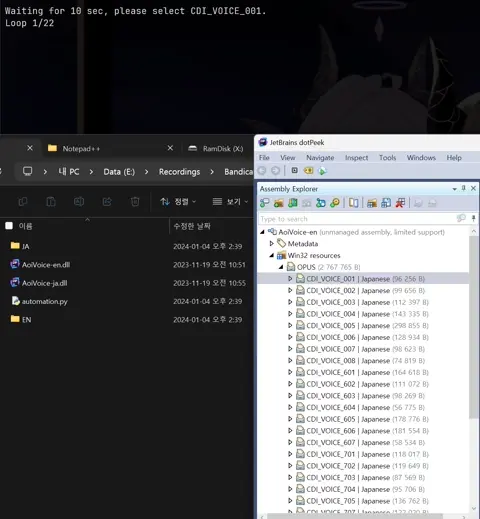

# Macros

Yep, some pyautogui macros.

---

### [cdi_voice_extract.py](cdi_voice_extract.py)
Script to automate key inputs for extracting voices from CrystalDiskInfo's voice `.DLL` files.
(C:/Program Files/CrystalDiskInfo/CdiResource/voice)

Requires Jetbrains DotPeek.

