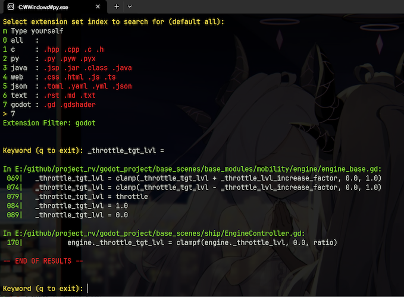

# Singlescript Tools
Bunch of standalone scripts I wrote for use in daily life.

### Suffixes

- `_▽` : indicates drag & drop tool
- `_O` : indicates continuously running tool
- `_m` : indicates module

### Note

Drag dropping on script requires proper handler.

- For py `< 3.14`: Default installation's pylauncher ships with it. If not, try [this](https://stackoverflow.com/questions/142844)
- For py `>= 3.14`: Requires `>= 25.1` [msi installer](https://www.python.org/downloads/windows/) of py install manager (refer [this](https://github.com/python/pymanager/issues/217))

## List

---

### [auto_html_reload_O.py](auto_html_reload_O.py)
Watches for html file changes and reload pages with selenium


<br>
<br>


---

### [copy_file_recursive.py](copy_file_recursive.py)
Fetch all files with matching extension to script's location/Copied. Recursive.


<br>
<br>


---

### [delayed_dl_workload_server_O.py](delayed_dl_workload_server_O.py)
Async trio server for slow download simulation.

Written in 2022, copied from [gist](https://gist.github.com/jupiterbjy/b0ad9a4dca162195aa0673b69e0af5cd)


<br>
<br>


---

### [dumb_pure_async_api_server_m.py](dumb_pure_async_api_server_m.py)
Dumb probably unsafe async API server, purely made of included batteries BUT for trio for fun.

Run this module directly to start a test server. (run module directly to run this test yourself)

Example Usage:
```python
import asyncio
import pathlib

from dumb_pure_async_api_server_m import *

APP = DumbAPIServer()
ROOT = pathlib.Path(__file__).parent

DIR_LISTING = True
PLACEHOLDER_HTML = ...

@APP.get_deco("/delay_test")
async def delay_test(subdir: str, delay: str = "0", **_kwargs) -> HTTPResponse:

    if subdir:
        return HTTPResponse.redirect(f"/delay_test?delay=2")

    try:
        val = float(delay)
        assert val > 0
        await asyncio.sleep(val)
    except ValueError, AssertionError:
        return HTTPResponse.redirect(f"/delay_test?delay=2")

    return HTTPResponse.text(f"{delay}s wait done")

@APP.get_deco("/hello/nested")
async def nested(subdir: str, **kwargs) -> HTTPResponse:
    return HTTPResponse.text(f"(Hello, world!)^2\nsubdir: {subdir}\nparams:{kwargs}")

@APP.get_deco("/")
async def index(subdir: str, **_kwargs) -> HTTPResponse:
    if subdir:
        return serve_path(root, subdir, serve_listing=DIR_LISTING)

    if (root / "index.html").exists():
        return serve_path(root, serve_listing=DIR_LISTING)

    if DIR_LISTING:
        return serve_path(root, serve_listing=True)

    return HTTPResponse.html(placeholder_html)


if __name__ == "__main__":
    asyncio.run(APP.serve())
```

```text
Registered GET '/delay_test' -> 'delay_test'
Registered GET '/hello/nested' -> 'nested'
Registered GET '/' -> 'index'
Starting at http://127.0.0.1:8080 - Available GET:
http://127.0.0.1:8080/delay_test
http://127.0.0.1:8080/hello/nested
http://127.0.0.1:8080/

-> Receiving ---
{...
 'Directory': '/',
 'HTTP': 'HTTP/1.1',
 'Host': '127.0.0.1:8080',
 'Method': 'GET',
 ...
 'User-Agent': 'Mozilla/5.0 (Windows NT 10.0; Win64; x64; rv:146.0) '
               'Gecko/20100101 Firefox/146.0'}
--- Received

<- Responding ---
HTTP/1.1 200 OK
Content-Type: text/html
Content-Length: 159
Connection: close

--- Response sent
```


<br>
<br>


---

### [dumb_pure_async_server_O.py](dumb_pure_async_server_O.py)
Dumb probably unsafe async HTTP server, purely made of included batteries for fun.

Provides minimal-escape-protected file listing interface by default, can also serve static files such as HTML.

Rewrite of [stackoverflow answer](https://stackoverflow.com/a/70649803) I wrote.

For slightly better structure, refer `dumb_pure_async_api_server_m.py`.


<br>
<br>


---

### [dumb_trio_api_server_m.py](dumb_trio_api_server_m.py)
Dumb probably unsafe async API server, purely made of included batteries BUT for trio for fun.

Run this module directly to start a test server. (run module directly to run this test yourself)

Example Usage:
```python
import pathlib

import trio

from dumb_trio_api_server_m import *

APP = DumbAPIServer()
ROOT = pathlib.Path(__file__).parent
BG_TASK_NURSERY: trio.Nursery | None = None

DIR_LISTING = True
PLACEHOLDER_HTML = ...

@APP.get_deco("/delay_test")
async def delay_test(subdir: str, delay: str = "0", **_kwargs) -> HTTPResponse:

    if subdir:
        return HTTPResponse.redirect(f"/delay_test?delay=2")

    try:
        val = float(delay)
        assert val > 0
        await trio.sleep(val)
    except ValueError, AssertionError:
        return HTTPResponse.redirect(f"/delay_test?delay=2")

    return HTTPResponse.text(f"{delay}s wait done")

@APP.get_deco("/hello/nested")
async def nested(subdir: str, **kwargs) -> HTTPResponse:
    return HTTPResponse.text(f"(Hello, world!)^2\nsubdir: {subdir}\nparams:{kwargs}")

@APP.get_deco("/")
async def index(subdir: str, **_kwargs) -> HTTPResponse:
    if subdir:
        return serve_path(root, subdir, serve_listing=DIR_LISTING)

    if (root / "index.html").exists():
        return serve_path(root, serve_listing=DIR_LISTING)

    if DIR_LISTING:
        return serve_path(root, serve_listing=True)

    return HTTPResponse.html(placeholder_html)

async def driver():
    global BG_TASK_NURSERY
    BG_TASK_NURSERY = trio.open_nursery()

    async with BG_TASK_NURSERY as nursery:
        nursery.start_soon(APP.serve)


if __name__ == "__main__":
    trio.run(driver)
```

```text
Registered GET '/delay_test' -> 'delay_test'
Registered GET '/hello/nested' -> 'nested'
Registered GET '/' -> 'index'
Starting at http://127.0.0.1:8080 - Available GET:
http://127.0.0.1:8080/delay_test
http://127.0.0.1:8080/hello/nested
http://127.0.0.1:8080/

-> Receiving ---
{...
 'Directory': '/',
 'HTTP': 'HTTP/1.1',
 'Host': '127.0.0.1:8080',
 'Method': 'GET',
 ...
 'User-Agent': 'Mozilla/5.0 (Windows NT 10.0; Win64; x64; rv:146.0) '
               'Gecko/20100101 Firefox/146.0'}
--- Received

<- Responding ---
HTTP/1.1 200 OK
Content-Type: text/html
Content-Length: 159
Connection: close

--- Response sent
```


<br>
<br>


---

### [dumb_trio_server_O.py](dumb_trio_server_O.py)
Dumb probably unsafe async HTTP server, purely made of included batteries & trio async lib for fun.

This is separate from asyncio ver purely because I personally only prefer trio to asyncio,
but asyncio do allow writing something pure without 3rd party libraries - which is kinda fun in itself.

Provides minimal-escape-protected file listing interface by default, can also serve static files such as HTML.

Rewrite of [stackoverflow answer](https://stackoverflow.com/a/70649803) I wrote.

For slightly better structure, refer `dumb_trio_api_server_m.py`.


<br>
<br>


---

### [effective_work_timer_O.py](effective_work_timer_O.py)
Simple script to track focused window and measure total **ACTIVE** time
whenever there's input with configurable margin, windows only.

`pip install pywin32 psutil pynput`


<br>
<br>


---

### [favorite_save_file_reorder_▽.py](favorite_save_file_reorder_▽.py)
Script to reorder save files from 'Irotoridori no Sekai'.
Should work for all visual novels from FAVORITE.

ALWAYS backup first.

Example output:
```
Save start idx: 1
Input files: s004.bin s005.bin s010.bin s012.bin ... s121.bin s122.bin s123.bin

Proceed? (y/N): y
Renamed s004.bin to s001.bin
Renamed s005.bin to s002.bin
Renamed s010.bin to s003.bin
Renamed s012.bin to s004.bin
Renamed s015.bin to s005.bin
...
Renamed s123.bin to s088.bin

Press enter to exit:
```


<br>
<br>


---

### [fetch_transcript.py](fetch_transcript.py)
Fetches transcript from YouTube video
Currently broken as API is gone, will rewrite again when I need this

`pip install youtube-transcript-api, httpx`


<br>
<br>


---

### [ffmpeg_batch_av1_▽.py](ffmpeg_batch_av1_▽.py)
Convert batch files to av1 codec for storage saving. Assumes all passed paths
share common parent directory.

- Usecase 1: Drag-drop videos only, creates `./av1` directory and stores in it.
- Usecase 2: Drag-drop folders only, creates `../DIR_NAME_av1` directory and stores in it. Non-recursive.


Will create new directory named "av1" under the CWD,
since this script is designed to be for batch processing.

Also outputs `results.sqlite` that contains file size & compression ratio.

Requires FFMPEG


<br>
<br>


---

### [ffmpeg_batch_validate_▽.py](ffmpeg_batch_validate_▽.py)
Batch validates video files using ffmpeg - which just actually is decoding and looking for errors.

Requires FFMPEG


<br>
<br>


---

### [ffmpeg_playback_multiply_▽.py](ffmpeg_playback_multiply_▽.py)
Multiplies video playback speed by discarding frames.
Requires FFMPEG


<br>
<br>


---

### [file_line_char_count.py](file_line_char_count.py)
Counts number of lines and characters in predetermined file types.


<br>
<br>


---

### [file_walker_m.py](file_walker_m.py)
File system navigating class which remembers current director's contents


<br>
<br>


---

### [files_2_image_▽.py](files_2_image_▽.py)
Embeds file inside jpg metadata. Any decent unzipper can open as zip.

`pip install pillow`

Check usage by executing without parameters.


<br>
<br>


---

### [generate_script_list_markdown.py](generate_script_list_markdown.py)
Script for generating markdown entry for this SingleScriptTools.
Assuming every script in directory starts with docstring.


<br>
<br>


---

### [get_module_reference_m.py](get_module_reference_m.py)
Module wrapping `inspect` module to list classes, functions in specified module


<br>
<br>


---

### [gif_remove_alpha_▽.py](gif_remove_alpha_▽.py)
Remove alpha channel from gif image, replacing it with desired color.

`pip install pillow`


<br>
<br>


---

### [image_parallel_merge_▽.py](image_parallel_merge_▽.py)
Merges multiple images into one big tiled image with desired height & width ratio.

`pillow-avif-plugin` is optional, but recommended for AVIF support.

`pip install pillow, pillow-avif-plugin`


<br>
<br>


---

### [image_remove_gps_▽.py](image_remove_gps_▽.py)
Removes GPS tags from image EXIF data

`pip install exif`


<br>
<br>


---

### [img_2_pdf_▽.py](img_2_pdf_▽.py)
Convert multiple images into single pdf.
Refer `pdf_2_img` for inverse.

`pip install pillow`


<br>
<br>


---

### [img_2_turtle_▽.py](img_2_turtle_▽.py)
Generates hardcoded turtle drawing script drawing contour out of image.

`pip install opencv-python, numpy, pillow`


<br>
<br>


---

### [img_audio_2_vid_▽.py](img_audio_2_vid_▽.py)
Script to convert image + audio to video via FFMPEG. (Basically bloated bash script)
Assumes FFMPEG exists in PATH.

If not, install via `scoop install ffmpeg` or `sudo apt install ffmpeg` or whatever pkg manager you use.

Drag & drop image and audio to create video.


<br>
<br>


---

### [img_auto_rename_O.py](img_auto_rename_O.py)


`pip install watchdog, trio`

Based on watchdog_file_events, renames newly added images using current time as name.

On duplicated name, will start adding suffixes. Despite it being costly, it rarely happens anyway!

This is purely for me who tend to drag-drop images I see online to desktop, then organize later.

Since especially YouTube Community images are all named 'unnamed' which always duplicates,
requiring me to rename existing images first, I made this just for that rare use-case.

This may not work on non-Windows, due to this script depending on `pathlib.Path.rename` to
[raise](https://docs.python.org/3.12/library/pathlib.html#pathlib.Path.rename) FileExistsError
on failure.


<br>
<br>


---

### [img_height_lim_▽.py](img_height_lim_▽.py)
Simply resizes images to certain height, so it looks better when ordered in markdown or anything.
Only intended for non-animated, non-indexed color images (png & jpg mostly)

!! This WILL overwrite original files. !!

`pip install pillow`


<br>
<br>


---

### [img_remove_alpha_▽.py](img_remove_alpha_▽.py)
Remove alpha channel from image with desired color.

`pip install pillow`


<br>
<br>


---

### [imgur_album_to_html.py](imgur_album_to_html.py)
Downloads imgur album(with descriptions) and converts into html with concurrent downloading.

Downloads all image/videos and generates:

- `online_lookup.html`: Uses imgur's original link, a workaround for sharing private album since imgur blocked it
- `offline_lookup.html`: Uses downloaded image/video paths


Example output:
```text
Album list: ['abcdefg']
---
[abcdefg] Downloading 413 images
[4uwdbyL] Downloaded
...
[qvuPRUh] File already exists, skipping
[abcdefg] Generating HTML for standalone HTML share
[abcdefg] Generating HTML for lookup
[abcdefg] All done
```


<br>
<br>


---

### [logging_config_m.py](logging_config_m.py)
Just use loguru, I used this until I found it.


<br>
<br>


---

### [m3u8_gen.py](m3u8_gen.py)
Generates m3u8 file using audio files in current directory. Recursive.

`pip install mutagen`


<br>
<br>


---

### [pdf_2_img_▽.py](pdf_2_img_▽.py)
Split image pdf back to multiple images

`pip install pypdf`


<br>
<br>


---

### [periodic_dir_sync_O.py](periodic_dir_sync_O.py)
Syncs two independent directories periodically, with file extension whitelist.

Used to sync dependant resources real time while writing my own static webpage builder for github.io page.

Definitely very inefficient but quick to write than using watchdog and watching over


<br>
<br>


---

### [process_runtime_tracker_O.py](process_runtime_tracker_O.py)
Simple (& terrible) script to track process runtime by pooling processes every 10 seconds.

Either edit `PROCESS_WHITELIST` or use argument to specify which processes to track.
Tracked time is written to a sqlite3 database created next to this script.

No external dependencies are required, as long as provided default `PROC_LIST_CMD` works for you.


<br>
<br>


---

### [project_media_html_index_▽.py](project_media_html_index_▽.py)
Generates HTML file to act as index for media files (audio, image, video).
Intended for creating fast lookup index for your local projects.

Assumes media exists in top level of each directory.

Usage:

1. Execute next to project directories to generate for all suitable subdir
2. Pass project directories as param(or drag drop) instead as whitelist

Either way, it will generate index.html in the same directory as script.


<br>
<br>


---

### [remote_execution_server_O.py](remote_execution_server_O.py)
> WARNING: This is VERY UNSAFE and should not be used in general.

Copied from [gist](https://gist.github.com/jupiterbjy/dcf4dd27784c80369b76c65d2077b643)

Prototype written back in (probably) 2021, this was created to test feasibility of running python scripts
from discord without exposing the bot host, and this is server part of bot's
[module](https://github.com/jupiterbjy/Meow_py/tree/main/Meowpy/BotComponents/PythonExecution).

This listens for incoming connections and execute received python codes.
Obviously this is very dangerous. This is to be run on overlayFS with Raspbian.


<br>
<br>


---

### [replace_to_uid_▽.py](replace_to_uid_▽.py)
WARING - Experimental script. Make sure to archive your project.

Simple script to automatically follow & replace `res://` path to
`uid://` introduced in godot 4.4 dev5.

Assuming utf8 encoding as every sane people should do.

Also ignores addon directory.


<br>
<br>


---

### [search.py](search.py)


Searches for lines containing given keyword.
Has options to Filter multiple extensions for searching.


<br>
<br>


---

### [singledispatch_for_object_m.py](singledispatch_for_object_m.py)
Mimics functools.singledispatch, but for objects.
usage is also almost identical.


<br>
<br>


---

### [split_img_fixed_size_▽.py](split_img_fixed_size_▽.py)
Cuts the image fixed-size from top left corner.

`pip install pillow`

Designed to cut some sprites in Armada Tanks for recreating.


<br>
<br>


---

### [squarefy_image_▽.py](squarefy_image_▽.py)
Simply makes images perfect square by extending from shorter dimension.

`pip install pillow`


<br>
<br>


---

### [steam_m4s_merge_▽.py](steam_m4s_merge_▽.py)
Merges m4s files of steam's recording clips into mp4. Zero dependency.

This script exists because as of 2024-10-14 steam beta is broken and can't export video properly.
<sub>(As of 11-17 STILL NOT WORKING so we'll need this script a bit longer...)</sub>

Requires ffmpeg in PATH - Install it using package manager of your like, e.g.:

```shell
# windows - scoop
scoop install ffmpeg

# debian
apt install ffmpeg

# ... or download manually and add to PATH!
```

Refer `-h` for usage.

|  |
|-------------------------------------|
| Test run with few clips             |


<br>
<br>


---

### [strip_image_frame_▽.py](strip_image_frame_▽.py)


`pip install pillow`

Simple script to strip n pixel from its border.

Resulting images will be saved at individual image locations with `_stripped` suffix.

Created this due to Bandicam keeps capturing images 2 pixel radius wider than actual window is.
Imagine dozens of such images to edit, hence this is.


<br>
<br>


---

### [twitch_point_clicker.py](twitch_point_clicker.py)
Dumb script that looks for twitch points button element on chat and clicks it

`pip install selenium`


<br>
<br>


---

### [unicodify_▽.py](unicodify_▽.py)
A very primitive script to unicode-fy passed text files, such as mass csv files, etc


<br>
<br>


---

### [update_registry_userdir.py](update_registry_userdir.py)
Script to update all registry entries after changing user directory name.
Primarily intended to be used for Win10 as a stopgap measure before reinstalling.

This script recursively update all affected paths containing *target* keyword
Honestly this would've been better done with usual batchscript, or maybe not.

There is no safety feature in this, use with caution!


<br>
<br>


---

### [validate_m3u_▽.py](validate_m3u_▽.py)
Simply checks if all files in folder is included in m3u file in the same dir
or if any of listed entry is missing


<br>
<br>


---

### [vn_save_reorder.py](vn_save_reorder.py)
`WARNING: UNTESTED SCRIPT`

Script to 'compact' order of save files in various visual novels.

Basically generalized version of `favorite_save_file_reorder_▽.py`

e.g. compacting save file range of 1~30 would compacts `(2, 3, 6, 12, 28)` to `(1, 2, 3, 4, 5)`.

Though beware, ALWAYS backup first.

Currently supported formats:
- FAVORITE: `s001.bin`
- YUZUSOFT/Madosoft, KiriKiri-engine page based: `data_0001_01.jpg`
- (DOES NOT WORK) AsaProject's recent works: (e.g. `renrowa51.bmp`, `sukitosuki51.bmp`)

I can't figure out why and how to make it work for ASAProject, as I can't figure out the general
mechanism at all - image files purely serve as thumbnail and no more.


<br>
<br>


---

### [watchdog_file_events_m.py](watchdog_file_events_m.py)
Watchdog callback register-able custom handler to see what's going on in current directory.

`pip install watchdog`

```python
import pathlib

from watchdog_file_events_m import start_watchdog, FileSystemEvent, FileCreatedEvent

def _cb(event: FileSystemEvent):
    print(f"Callback triggered for {event.__class__.__name__} at {event.src_path}")

with start_watchdog(str(pathlib.Path(__file__).parent.absolute()), True) as handler:

    handler.register(FileCreatedEvent, _cb)

    # handler.register_on_file_creation(_cb)
    handler.register_on_file_deletion(_cb)
    handler.register_on_file_modification(_cb)
    handler.register_on_file_move(_cb)

    # handler.register_global(_cb)

    try:
        while True:
            time.sleep(1)
    except KeyboardInterrupt:
        return
```


<br>
<br>


---

### [webcam_periodic_capture_O.py](webcam_periodic_capture_O.py)
Script to capture webcam images periodically.

`pip install opencv-python`


<br>
<br>


---

### [webp_split_▽.py](webp_split_▽.py)
Just a Imagemagick wrapper to batch split webp into frames.

Made because I messed up few frames in ScreenToGif but it couldn't read webp it generated.

Requires Imagemagick in PATH.


<br>
<br>

