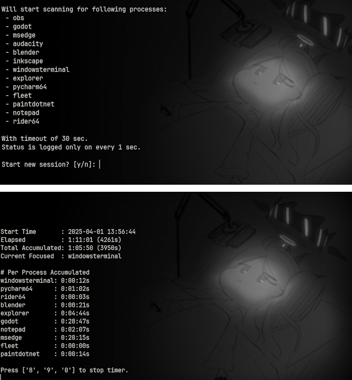
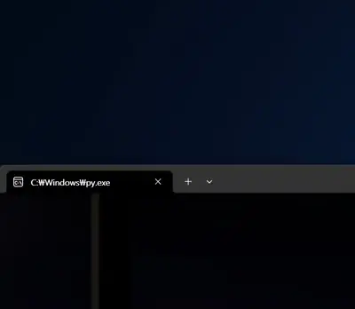

# Singlescript Tools
Bunch of standalone scripts I wrote for use in daily life

## List

- ▽ : indicates that it's drag & drop tool.
- ○ : indicates that it's background running tool.

---

### [auto_html_reload.py](auto_html_reload.py)
Watches for html file changes and reload pages with selenium


<br>
<br>


---

### [copy_file_recursive.py](copy_file_recursive.py)
Fetch all files with matching extension to script's location/Copied. Recursive.


<br>
<br>


---

### [effective_work_timer.py](effective_work_timer.py)
Simple script to track focused window and measure total time
whenever there's input with configurable margin, windows only.

`pip install pywin32 psutil pynput`




<br>
<br>


---

### [favorite_save_file_reorder_▽.py](favorite_save_file_reorder_▽.py)
Script to reorder save files from 'Irotoridori no Sekai'.
Should work for all visual novels from FAVORITE.

ALWAYS backup first.

Example output:
```
Save start idx: 1
Input files: s004.bin s005.bin s010.bin s012.bin ... s121.bin s122.bin s123.bin

Proceed? (y/N): y
Renamed s004.bin to s001.bin
Renamed s005.bin to s002.bin
Renamed s010.bin to s003.bin
Renamed s012.bin to s004.bin
Renamed s015.bin to s005.bin
...
Renamed s123.bin to s088.bin

Press enter to exit:
```


<br>
<br>


---

### [fetch_transcript.py](fetch_transcript.py)
Fetches transcript from YouTube video
Currently broken as API is gone, will rewrite again when I need this

`pip install youtube-transcript-api, httpx`


<br>
<br>


---

### [ffmpeg_playback_multiply_▽.py](ffmpeg_playback_multiply_▽.py)
Multiplies video playback speed by discarding frames without encoding
Requires FFMPEG


<br>
<br>


---

### [files_2_image_▽.py](files_2_image_▽.py)
Embeds file inside jpg metadata. Any decent unzipper can open as zip.

`pip install pillow`

Check usage by executing without parameters.


<br>
<br>


---

### [file_line_char_count.py](file_line_char_count.py)
Counts number of lines and characters in predetermined file types.


<br>
<br>


---

### [file_walker.py](file_walker.py)
File system navigating class which remembers current director's contents


<br>
<br>


---

### [generate_script_list_markdown.py](generate_script_list_markdown.py)
Script for generating markdown entry for this SingleScriptTools.
Assuming every script in directory starts with docstring.


<br>
<br>


---

### [get_module_reference.py](get_module_reference.py)
Module wrapping `inspect` module to list classes, functions in specified module


<br>
<br>


---

### [gif_remove_alpha_▽.py](gif_remove_alpha_▽.py)
Remove alpha channel from gif image, replacing it with desired color.

`pip install pillow`


<br>
<br>


---

### [image_parallel_merge_▽.py](image_parallel_merge_▽.py)
Merges multiple images into one big tiled image with desired height & width ratio.

`pillow-avif-plugin` is optional, but recommended for AVIF support.

`pip install pillow, pillow-avif-plugin`


<br>
<br>


---

### [image_remove_gps_▽.py](image_remove_gps_▽.py)
Removes GPS tags from image EXIF data

`pip install exif`


<br>
<br>


---

### [imgur_album_to_html.py](imgur_album_to_html.py)
Downloads imgur album(with descriptions) and converts into html with concurrent downloading.

Downloads all image/videos and generates:

- `online_lookup.html`: Uses imgur's original link, a workaround for sharing private album since imgur blocked it
- `offline_lookup.html`: Uses downloaded image/video paths


Example output:
```text
Album list: ['abcdefg']
---
[abcdefg] Downloading 413 images
[4uwdbyL] Downloaded
...
[qvuPRUh] File already exists, skipping
[abcdefg] Generating HTML for standalone HTML share
[abcdefg] Generating HTML for lookup
[abcdefg] All done
```


<br>
<br>


---

### [img_2_pdf_▽.py](img_2_pdf_▽.py)
Convert multiples images into single pdf

`pip install pillow`


<br>
<br>


---

### [img_2_turtle_▽.py](img_2_turtle_▽.py)
Generates hardcoded turtle drawing script drawing contour out of image.

`pip install opencv-python, numpy, pillow`


<br>
<br>


---

### [img_audio_2_vid_▽.py](img_audio_2_vid_▽.py)
Script to convert image + audio to video via FFMPEG. (Basically bloated bash script)
Assumes FFMPEG exists in PATH.

If not, install via `scoop install ffmpeg` or `sudo apt install ffmpeg` or whatever pkg manager you use.

Drag & drop image and audio to create video.


<br>
<br>


---

### [img_auto_rename_○.py](img_auto_rename_○.py)


`pip install watchdog, trio`

Based on watchdog_file_events, renames newly added images using current time as name.

On duplicated name, will start adding suffixes. Despite it being costly, it rarely happens anyway!

This is purely for me who tend to drag-drop images I see online to desktop, then organize later.

Since especially YouTube Community images are all named 'unnamed' which always duplicates,
requiring me to rename existing images first, I made this just for that rare use-case.

This may not work on non-Windows, due to this script depending on `pathlib.Path.rename` to
[raise](https://docs.python.org/3.12/library/pathlib.html#pathlib.Path.rename) FileExistsError
on failure.


<br>
<br>


---

### [img_remove_alpha_▽.py](img_remove_alpha_▽.py)
Remove alpha channel from image with desired color.

`pip install pillow`


<br>
<br>


---

### [logging_config.py](logging_config.py)
Just use loguru, I used this until I found it.


<br>
<br>


---

### [m3u8_gen.py](m3u8_gen.py)
Generates m3u8 file using audio files in current directory. Recursive.

`pip install mutagen`


<br>
<br>


---

### [process_runtime_tracker.py](process_runtime_tracker.py)
Simple (& terrible) script to track process runtime by pooling processes every 10 seconds.

Either edit `PROCESS_WHITELIST` or use argument to specify which processes to track.
Tracked time is written to a sqlite3 database created next to this script.

No external dependencies are required, as long as provided default `PROC_LIST_CMD` works for you.


<br>
<br>


---

### [replace_to_uid_▽.py](replace_to_uid_▽.py)
WARING - Experimental script. Make sure to archive your project.

Simple script to automatically follow & replace `res://` path to
`uid://` introduced in godot 4.4 dev5.

Assuming utf8 encoding as every sane people should do.

Also ignores addon directory.


<br>
<br>


---

### [search.py](search.py)


Searches for lines containing given keyword.
Has options to Filter multiple extensions for searching.


<br>
<br>


---

### [singledispatch_for_object.py](singledispatch_for_object.py)
Mimics functools.singledispatch, but for objects.
usage is also almost identical.


<br>
<br>


---

### [split_img_fixed_size_▽.py](split_img_fixed_size_▽.py)
Cuts the image fixed-size from top left corner.

`pip install pillow`

Designed to cut some sprites in Armada Tanks for recreating.


<br>
<br>


---

### [squarefy_image_▽.py](squarefy_image_▽.py)
Simply makes images perfect square by extending from shorter dimension.

`pip install pillow`


<br>
<br>


---

### [steam_m4s_merge_▽.py](steam_m4s_merge_▽.py)
Merges m4s files of steam's recording clips into mp4. Zero dependency.

This script exists because as of 2024-10-14 steam beta is broken and can't export video properly.
As of 11-17 STILL NOT WORKING so we'll need this script a bit longer...

Refer -h for usage.

Requires ffmpeg in PATH.


<br>
<br>


---

### [strip_image_frame_▽.py](strip_image_frame_▽.py)


`pip install pillow`

Simple script to strip n pixel from its border.

Resulting images will be saved at individual image locations with `_stripped` suffix.

Created this due to Bandicam keeps capturing images 2 pixel radius wider than actual window is.
Imagine dozens of such images to edit, hence this is.


<br>
<br>


---

### [twitch_point_clicker.py](twitch_point_clicker.py)
Dumb script that looks for twitch points button element on chat and clicks it

`pip install selenium`


<br>
<br>


---

### [unicodify_▽.py](unicodify_▽.py)
A very primitive script to unicode-fy passed text files, such as mass csv files, etc


<br>
<br>


---

### [update_registry_userdir.py](update_registry_userdir.py)
Script to update all registry entries after changing user directory name.
Primarily intended to be used for Win10 as a stopgap measure before reinstalling.

This script recursively update all affected paths containing *target* keyword
Honestly this would've been better done with usual batchscript, or maybe not.

There is no safety feature in this, use with caution!


<br>
<br>


---

### [validate_m3u_▽.py](validate_m3u_▽.py)
Simply checks if all files in folder is included in m3u file in the same dir
or if any of listed entry is missing


<br>
<br>


---

### [watchdog_file_events.py](watchdog_file_events.py)
Watchdog callback register-able custom handler to see what's going on in current directory.

`pip install watchdog`


<br>
<br>


---

### [webcam_periodic_capture.py](webcam_periodic_capture.py)
Script to capture webcam images periodically.

`pip install opencv-python`


<br>
<br>

