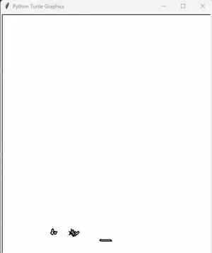
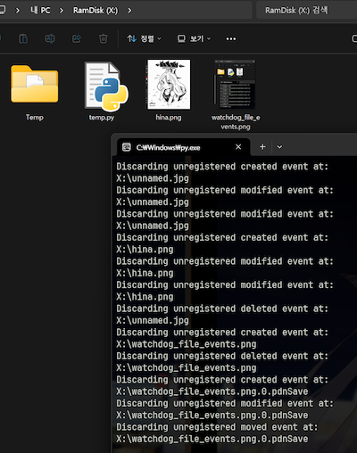

# Singlescript Tools
Bunch of standalone scripts I wrote for use in daily life

## List

- ▽ : indicates that it's drag & drop tool.
- ○ : indicates that it's background running tool.

---

### [auto_html_reload.py](auto_html_reload.py)
Watches for html file changes and reload pages with selenium

 
 

---

### [copy_file_recursive.py](copy_file_recursive.py)
Fetch all files with matching extension to script's location/Copied. Recursive.

 
 

---

### [fetch_transcript.py](fetch_transcript.py)
Fetches transcript from YouTube video
Currently broken as API is gone, will rewrite again when I need this

 
 

---

### [ffmpeg_playback_multiply_▽.py](ffmpeg_playback_multiply_▽.py)
Multiplies video playback speed by discarding frames without encoding
Requires FFMPEG

 
 

---

### [files_2_image_▽.py](files_2_image_▽.py)
Embeds file inside jpg metadata. Any decent unzipper can open as zip.

Check usage by executing without parameters

 
 

---

### [file_walker.py](file_walker.py)
File system navigating class which remembers current director's contents

 
 

---

### [generate_script_list_markdown.py](generate_script_list_markdown.py)
Script for generating markdown entry for this SingleScriptTools.
Assuming every script in directory starts with docstring.

 
 

---

### [get_module_reference.py](get_module_reference.py)
Module wrapping `inspect` module to list classes, functions in specified module

 
 

---

### [image_parallel_merge_▽.py](image_parallel_merge_▽.py)
Merges multiple images into one big tiled image with desired height & width ratio.

 
 

---

### [img_2_pdf_▽.py](img_2_pdf_▽.py)
Convert multiples images into single pdf

 
 

---

### [img_2_turtle_▽.py](img_2_turtle_▽.py)
Generates hardcoded turtle drawing script drawing contour out of image.

 
 

---

### [img_auto_rename_○.py](img_auto_rename_○.py)

Based on watchdog_file_events, renames newly added images using current time as name.

On duplicated name, will start adding suffixes. Despite it being costly, it rarely happens anyway!

This is purely for me who tend to drag-drop images I see online to desktop, then organize later.

Since especially YouTube Community images are all named 'unnamed' which always duplicates,
requiring me to rename existing images first, I made this just for that rare use-case.

This may not work on non-Windows, due to this script depending on `pathlib.Path.rename` to
[raise](https://docs.python.org/3.12/library/pathlib.html#pathlib.Path.rename) FileExistsError
on failure.

 
 

---

### [logging_config.py](logging_config.py)
Just use loguru, I used this until I found it.

 
 

---

### [m3u8_gen.py](m3u8_gen.py)
Generates m3u8 file using audio files in current directory. Recursive.

 
 

---

### [singledispatch_for_object.py](singledispatch_for_object.py)
Mimics functools.singledispatch, but for objects.
usage is also almost identical.

 
 

---

### [split_img_fixed_size_▽.py](split_img_fixed_size_▽.py)
Cuts the image fixed-size from top left corner.

Designed to cut some sprites in Armada Tanks for recreating.

 
 

---

### [squarefy_image_▽.py](squarefy_image_▽.py)
Simply makes images perfect square by extending from shorter dimension.

 
 

---

### [strip_image_frame_▽.py](strip_image_frame_▽.py)

Simple script to strip n pixel from its border.

Resulting images will be saved at individual image locations with `_stripped` suffix.

Created this due to Bandicam keeps capturing images 2 pixel radius wider than actual window is.
Imagine dozens of such images to edit, hence this is.

 
 

---

### [twitch_point_clicker.py](twitch_point_clicker.py)
Dumb script that looks for twitch points button element on chat and clicks it

 
 

---

### [unicodify_▽.py](unicodify_▽.py)
A very primitive script to unicode-fy passed text files, such as mass csv files, etc

 
 

---

### [update_registry_userdir.py](update_registry_userdir.py)
Script to update all registry entries after changing user directory name.
Primarily intended to be used for Win10 as a stopgap measure before reinstalling.

This script recursively update all affected paths containing *target* keyword
Honestly this would've been better done with usual batchscript, or maybe not.

There is no safety feature in this, use with caution!

 
 

---

### [validate_m3u_▽.py](validate_m3u_▽.py)
Simply checks if all files in folder is included in m3u file in the same dir
or if any of listed entry is missing

 
 

---

### [watchdog_file_events.py](watchdog_file_events.py)
Watchdog callback register-able custom handler to see what's going on in current directory.

 
 

