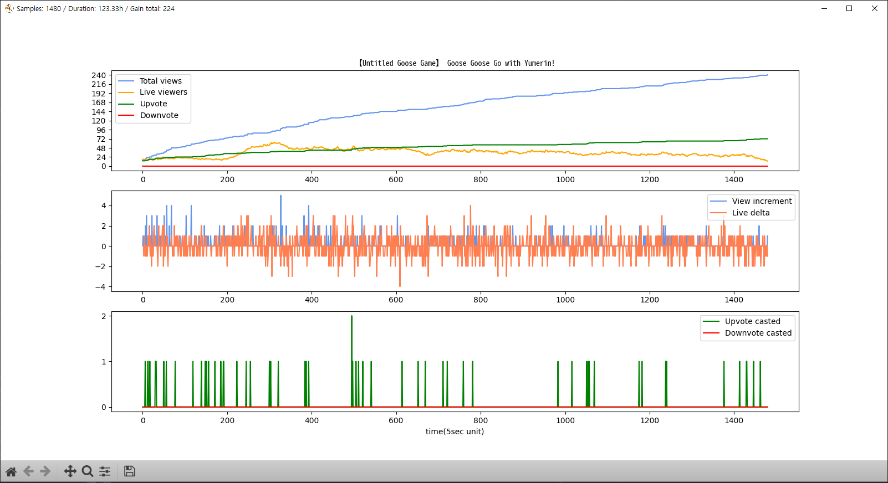

Just a micro repo for collecting and visualizing live stream stats.

Requires google cloud API to work. Very vague, possibly not so useful docs are included in each file.

Example data - not sure if I can just include stream name like that,

